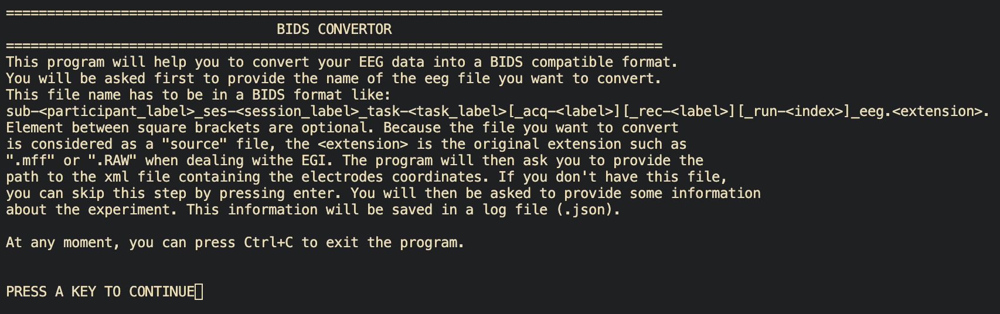

********
Usage
********

.. _Installation:

Installation
============
The package relies on MNE-python_ which is quite heavy and can take a very long time to install.
I would suggest to install MNE-python_ first and then install this package.
To `install MNE-python`_ you have several choices that are very well documented on their website:
https://mne.tools/stable/install/index.html

To install the package:

.. code-block:: console

   $ python3 -m pip install Sam54000_eeg_modules

.. _MNE-python: https://mne.tools/stable/index.html
.. _install MNE-python: https://mne.tools/stable/install/index.html

.. _Usage:

Usage
=====

BIDS format structure
_____________________

The biggest part of the package is the ``bids_conversion`` module that will convert a source EEG files into a `BIDS compliant dataset for EEG`_.
An EEG folder in a BIDS format should include the following files:

    * **`An EEG sidecar file`_** wich is in ``.json`` format. It contains general information about the EEG recording. 
    It has to be named according to the following convention::

        sub-<participant_label>[_ses-<session_label>]_task-<task_label>[_acq-<label>][_rec-<label>][_run-<index>]_eeg.json

    * **`A channels description file`_** which is a ``.tsv`` file. A channel is described as any stream of data which can be TTL triggers, 
    respiratory belt, EEG electrodes, etc. It has to be named according to the following convention::

        sub-<participant_label>[_ses-<session_label>]_task-<task_label>[_acq-<label>][_rec-<label>][_run-<index>]_channels.tsv

    * **`An electrodes description file`_** which is a ``.tsv`` file that contains the EEG electrodes coordinates.
        It has to be named according to the following convention::

        sub-<participant_label>[_ses-<session_label>]_task-<task_label>[_acq-<label>][_rec-<label>][_run-<index>]_electrodes.tsv

    * **`A coordinates system file`_** that contains the EEG electrodes coordinates system. It has to be named according to the following convention::

        sub-<participant_label>[_ses-<session_label>]_task-<task_label>[_acq-<label>][_rec-<label>][_run-<index>]_coordsystem.json

    * **`An events file`_** which is a ``.tsv`` file that contains events information. It has to be named according to the following convention::

        sub-<participant_label>[_ses-<session_label>]_task-<task_label>[_acq-<label>][_rec-<label>][_run-<index>]_events.tsv

    * **`An events description file`_** that give additional information about the entry of the events table file.
        It has to be named according to the following convention::

        sub-<participant_label>[_ses-<session_label>]_task-<task_label>[_acq-<label>][_rec-<label>][_run-<index>]_events.json

    * **The EEG file** that contains the EEG data. It should be in a standardized format such as .edf 
        (see: `The EEG section on BIDS website`_ for more information on standarized format).
        It has to be named according to the following convention::

        sub-<participant_label>[_ses-<session_label>]_task-<task_label>[_acq-<label>][_rec-<label>][_run-<index>]_eeg.edf

EXAMPLE:
^^^^^^^^

* For one EEG file recorded on an EGI system: ``sub-<label>_ses-<label>_task-<label>_eeg.mff``
* For one electrodes_location recorded with a GeoScan system: ``sub-<label>_ses-<label>_task-<label>_desc-geoscan.xml``

The program will take the information from the source files (name and data) and will create this tree::

   root
      |_ sub-<label>
            |_ ses-<label>
                  |_ eeg
                        |_ sub-<label>_ses-<label>_task-<label>_eeg.json
                        |_ sub-<label>_ses-<label>_task-<label>_channels.tsv
                        |_ sub-<label>_ses-<label>_task-<label>_electrodes.tsv
                        |_ sub-<label>_ses-<label>_task-<label>_events.tsv
                        |_ sub-<label>_ses-<label>_task-<label>_eeg.edf

Step-by-step guide for the conversion
_____________________________________

The EEG file coming directly out of the machine is called ``source`` file. It is a binary file that contains the raw EEG data and has an extension
that is specific to the machine that recorded the EEG. For example:

* The source file coming from a Biosemi_ machine will have a ``.bdf`` extension
* The source file coming from a BrainVision_ machine will have a ``.vhdr`` extension
* The source file coming from a EGI_ machine will have a ``.mff``, ``.RAW`` or ``.raw`` extension

First step
^^^^^^^^^^

First, double check in the recording machine that source files are `HIPPA compliant`_.
Then transfer the source files from the machine to the computer where you want to convert the EEG files.

Check the name of the source EEG file and make sure that it is in a standardized format::
    
   sub-<label>_ses-<label>_task-<label>_eeg.<extension>

Check the name of the source electrodes location file and make sure that it is in a standardized format::

   sub-<label>_ses-<label>_task-<label>_desc-<label>.<extension>

Second step
^^^^^^^^^^^

Run in the terminal

.. code-block:: console

   $ bids_conversion

A first screen will display a documentation  that recapitulate what the program will do 
and what to prepare.

Then, the program will ask to enter the path to the source EEG file and the path to the source electrodes location file.
It is possible to drag and drop the file into the terminal to get the path:

.. code-block:: console

   Enter the path to the source EEG file: /Users/username/folder/sub-<label>_ses-<label>_task-<label>_eeg.<extension>
   Enter the path to the source electrodes location file: /Users/username/folder/sub-<label>_ses-<label>_task-<label>_desc-<label>.<extension>

Third step
^^^^^^^^^^

.. _`BIDS compliant dataset for EEG`: https://bids-specification.readthedocs.io/en/stable/04-modality-specific-files/03-electroencephalography.html
.. _`An EEG sidecar file`: https://bids-specification.readthedocs.io/en/stable/04-modality-specific-files/03-electroencephalography.html#sidecar-json-_eegjson
.. _`A channels description file`: https://bids-specification.readthedocs.io/en/stable/04-modality-specific-files/03-electroencephalography.html#channels-description-_channelstsv
.. _`An electrodes description file`: https://bids-specification.readthedocs.io/en/stable/04-modality-specific-files/03-electroencephalography.html#electrodes-description-_electrodestsv
.. _`A coordinates system file`: https://bids-specification.readthedocs.io/en/stable/04-modality-specific-files/03-electroencephalography.html#coordinate-system-json-_coordsystemjson
.. _`An events file`: https://bids-specification.readthedocs.io/en/stable/04-modality-specific-files/05-task-events.html#task-events
.. _`An events description file`: https://bids-specification.readthedocs.io/en/stable/04-modality-specific-files/05-task-events.html#task-events
.. _`The EEG section on BIDS website`: https://bids-specification.readthedocs.io/en/stable/04-modality-specific-files/03-electroencephalography.html#eeg-recording-data
.. _Biosemi: https://www.biosemi.com/faq/file_format.htm
.. _BrainVision: https://www.brainproducts.com/productdetails.php?id=21&tab=5
.. _EGI: https://www.egi.com/egi-file-formats/
.. _`HIPPA compliant`:https://www.hhs.gov/hipaa/for-professionals/security/laws-regulations/index.html